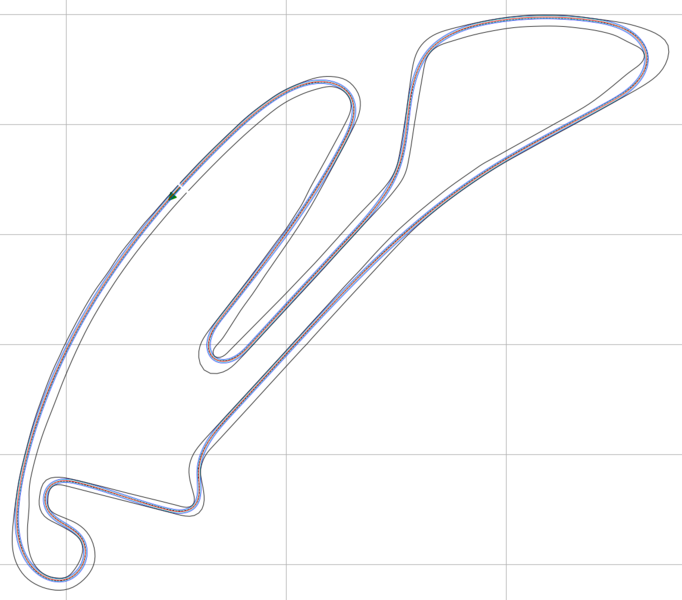

# Introduction
This repository contains algorithms that allow us to determine an optimal racing line on a race track. You can chose
between several objectives:
* Shortest path
* Minimum curvature (with or without iterative call)
* Minimum time
* Minimum time with powertrain behavior consideration

The minimum curvature line is quite near to a minimum time line in corners but will differ as soon as the car's
acceleration limits are not exploited. However, the minimum time optimization requires a lot more parameters and takes
more computation time. Please look into the `main_globaltraj.py` for all possible options.

# List of components
* `frictionmap`: This package contains the functions related to the creation and handling of friction maps along the
race track.
* `helper_funcs_glob`: This package contains some helper functions used in several other functions when 
calculating the global race trajectory.
* `inputs`: This folder contains the vehicle dynamics information, the reference track csvs and friction maps.
* `opt_mintime_traj`: This package contains the functions required to find the time-optimal trajectory. 
  
  It also includes the powertrain components in `opt_mintime_traj/powertrain_src` used to calculate power losses and 
  thermal behavior of the powertrain and to consider the state of charge of the battery.
* `params`: This folder contains a parameter file with optimization and vehicle parameters.

# Trajectory Planning Helpers repository
Lots of the required functions for trajectory planning are cumulated in our trajectory planning helpers repository. It
can be found on https://github.com/TUMFTM/trajectory_planning_helpers. They can be quite useful for other projects as
well.

# Dependencies
Use the provided `requirements.txt` in the root directory of this repo, in order to install all required modules.\
`pip3 install -r /path/to/requirements.txt`

The code is developed with Ubuntu 20.04 LTS and Python 3.7.

### Solutions for possible installation problems (Windows)
* `cvxpy`, `cython` or any other package requires a `Visual C++ compiler` -> Download the build tools for Visual Studio
2019 (https://visualstudio.microsoft.com/de/downloads/ -> tools for Visual Studio 2019 -> build tools), install them and
chose the `C++ build tools` option to install the required C++ compiler and its dependencies
* Problems with quadprog -> reason currently not clear, test using quadprog in version 0.1.6 instead 0.1.7

### Solutions for possible installation problems (Ubuntu)
* `matplotlib` requires `tkinter` -> can be solved by `sudo apt install python3-tk`
* `Python.h` required `quadprog` -> can be solved by `sudo apt install python3-dev`

# Creating your own friction map
The script `main_gen_frictionmap.py` can be used to create your own friction map for any race track file supplied in the
input folder. The resulting maps are stored in the `inputs/frictionmaps` folder. These friction maps can be used within
the minimum time optimization. In principle, they can also be considered within the velocity profile calculation of the
minimum curvature planner. However, this is currently not supported from our side.

# Running the code
* `Step 1:` (optional) Adjust the parameter file that can be found in the `params` folder (required file).
* `Step 2:` (optional) Adjust the ggv diagram and ax_max_machines file in `inputs/veh_dyn_info` (if used). This
acceleration should be calculated without drag resistance, i.e. simply by F_x_drivetrain / m_veh!
* `Step 3:` (optional) Add your own reference track file in `inputs/tracks` (required file).
* `Step 4:` (optional) Add your own friction map files in `inputs/frictionmaps` (if used).
* `Step 5:` (optional) If you want to consider the powertrain behavior (thermal behavior, power loss, state of charge),
enable the powertrain-option in the parameter file (`/params`) and adjust the powertrain parameters as needed. Set the
number of race laps in the dict `imp_opts` in `main_globaltraj.py` and specify a non-regular discretization step length
for faster optimization in the parameter file (`/params`) (if used). You can select a simple approximation of the 
  powertrain components by setting `/params/racecar.ini:simple_loss = True` or consider more detailed models by 
  specifying `/params/racecar.ini:simple_loss = False`.
* `Step 6:` Adjust the parameters in the upper part of `main_globaltraj.py` and execute it to start the trajectory 
generation process. The calculated race trajectory is stored in `outputs/traj_race_cl.csv`.

IMPORTANT: For further information on the minimum time optimization have a look into the according `Readme.md` which can
be found in the `opt_mintime_traj` folder!

# Wording and conventions
We tried to keep a consistant wording for the variable names:
* path -> [x, y] Describes any array containing x,y coordinates of points (i.e. point coordinates).\
* refline -> [x, y] A path that is used as reference line during our calculations.\
* reftrack -> [x, y, w_tr_right, w_tr_left] An array that contains not only the reference line information but also
right and left track widths. In our case it contains the race track that is used as a basis for the raceline
optimization.

Our normal vectors usually point to the right in the direction of driving. Therefore, we get the track boundaries by
multiplication as follows: norm_vector * w_tr_right, -norm_vector * w_tr_left.

# Trajectory definition
The global racetrajectory optimization currently supports two output formats:

* *Race Trajectory* - (default) holds detailed information about the race trajectory.
* *LTPL Trajectory* - holds source information about the race trajectory as well as information about the track bounds
  and tue reference line (the actual race trajectory has to be calculated based on the stored information).

In order to en-/disable the export of any of these files, add the respective entry to the 'file_paths'-dict in the
'main_globtraj.py'-script (search for `# assemble export paths`). By the default, the file path for the
'LTPL Trajectory' is commented out.

Details about the individual formats are given in the following.

### Race Trajectory
The output csv contains the global race trajectory. The array is of size [no_points x 7] where no_points depends on
stepsize and track length. The seven columns are structured as follows:

* `s_m`: float32, meter. Curvi-linear distance along the raceline.
* `x_m`: float32, meter. X-coordinate of raceline point.
* `y_m`: float32, meter. Y-coordinate of raceline point.
* `psi_rad`: float32, rad. Heading of raceline in current point from -pi to +pi rad. Zero is north (along y-axis).
* `kappa_radpm`: float32, rad/meter. Curvature of raceline in current point.
* `vx_mps`: float32, meter/second. Target velocity in current point.
* `ax_mps2`: float32, meter/second². Target acceleration in current point. We assume this acceleration to be constant
  from current point until next point.

### LTPL Trajectory
The output csv contains the source information of the global race trajectory and map information via the normal vectors.
The array is of size [no_points x 12] where no_points depends on step size and track length. The seven columns are
structured as follows:

* `x_ref_m`: float32, meter. X-coordinate of reference line point (e.g. center line of the track).
* `y_ref_m`: float32, meter. Y-coordinate of reference line point (e.g. center line of the track).
* `width_right_m`: float32, meter. Distance between reference line point and right track bound (along normal vector).
* `width_left_m`: float32, meter. Distance between reference line point and left track bound (along normal vector).
* `x_normvec_m`: float32, meter. X-coordinate of the normalized normal vector based on the reference line point.
* `y_normvec_m`: float32, meter. Y-coordinate of the normalized normal vector based on the reference line point.
* `alpha_m`: float32, meter. Solution of the opt. problem holding the lateral shift in m for the reference line point.
* `s_racetraj_m`: float32, meter. Curvi-linear distance along the race line.
* `psi_racetraj_rad`: float32, rad. Heading of raceline in current point from -pi to +pi rad. Zero is north.
* `kappa_racetraj_radpm`: float32, rad/meter. Curvature of raceline in current point.
* `vx_racetraj_mps`: float32, meter/second. Target velocity in current point.
* `ax_racetraj_mps2`: float32, meter/second². Target acceleration in current point. We assume this acceleration to be
  constant from current point until next point.
  
The generated file can be directly imported by the
[graph-based local trajectory planner](https://github.com/TUMFTM/GraphBasedLocalTrajectoryPlanner).

# References
* Minimum Curvature Trajectory Planning\
Heilmeier, Wischnewski, Hermansdorfer, Betz, Lienkamp, Lohmann\
Minimum Curvature Trajectory Planning and Control for an Autonomous Racecar\
DOI: 10.1080/00423114.2019.1631455\
Contact person: [Alexander Heilmeier](mailto:alexander.heilmeier@tum.de).

* Time-Optimal Trajectory Planning\
Christ, Wischnewski, Heilmeier, Lohmann\
Time-Optimal Trajectory Planning for a Race Car Considering Variable Tire-Road Friction Coefficients\
DOI: 10.1080/00423114.2019.1704804\
Contact person: [Fabian Christ](mailto:fabian.christ@tum.de).

* Friction Map Generation\
Hermansdorfer, Betz, Lienkamp\
A Concept for Estimation and Prediction of the Tire-Road Friction Potential for an Autonomous Racecar\
DOI: 10.1109/ITSC.2019.8917024\
Contact person: [Leonhard Hermansdorfer](mailto:leo.hermansdorfer@tum.de).

* Powertrain Behavior\
Herrmann, Passigato, Betz, Lienkamp\
Minimum Race-Time Planning-Strategy for an Autonomous Electric Racecar\
DOI: 10.1109/ITSC45102.2020.9294681\
Preprint: https://arxiv.org/abs/2005.07127 \
Contact person: [Thomas Herrmann](mailto:thomas.herrmann@tum.de).
